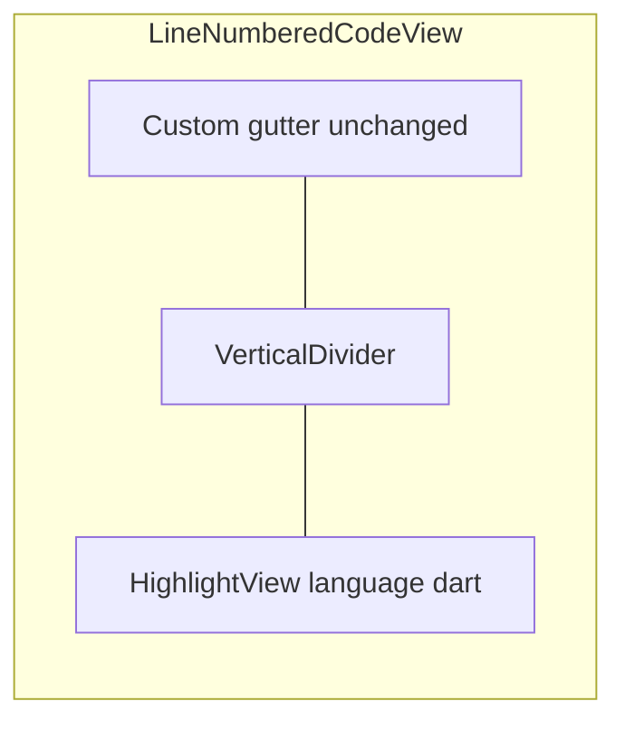

# flutter_highlight syntax highlighting

## Goal

Colorize Dart source in expanded code panels (keywords, strings, comments, types) similar to [DartPad](https://dartpad.dev/), by swapping the plain `Text` in [`line_numbered_code_view.dart`](solid_principles/lib/presentation/widgets/line_numbered_code_view.dart) for `HighlightView` from [`flutter_highlight`](https://pub.dev/packages/flutter_highlight).

## Approach

Keep the **existing custom gutter** (line numbers stay non-selectable, layout already works). Only the code pane changes.



## Changes

### 1. Add dependency

Update [`solid_principles/pubspec.yaml`](solid_principles/pubspec.yaml):

```yaml
dependencies:
  flutter:
    sdk: flutter
  flutter_highlight: ^0.7.0
```

Run `flutter pub get`.

### 2. Update `LineNumberedCodeView`

File: [`solid_principles/lib/presentation/widgets/line_numbered_code_view.dart`](solid_principles/lib/presentation/widgets/line_numbered_code_view.dart)

**Imports:**
```dart
import 'package:flutter_highlight/flutter_highlight.dart';
import 'package:flutter_highlight/themes/atom-one-dark.dart';
```

**Replace** the code-pane `Text` (lines 57–61) with:

```dart
HighlightView(
  code,
  language: 'dart',
  theme: atomOneDarkTheme,
  padding: EdgeInsets.zero,
  textStyle: TextStyle(
    fontFamily: 'monospace',
    fontSize: _fontSize,
    height: _lineHeight,
  ),
)
```

**Theme choice:** `atomOneDarkTheme` matches the app’s default dark mode. Import only this one theme file to avoid bloating the bundle with unused themes.

**Layout notes:**
- Keep `SelectionArea` + horizontal `SingleChildScrollView` wrapper around `HighlightView` for copy/select and long-line scroll.
- Keep outer `Container` in [`source_file_panel.dart`](solid_principles/lib/presentation/widgets/source_file_panel.dart) (`surfaceContainerHighest`) as the code block background — `HighlightView` renders on top of that.
- Remove unused `codeStyle` variable if only the gutter uses `gutterStyle` afterward.
- Gutter column unchanged: same `_fontSize` / `_lineHeight` so numbers align with highlighted lines.

### 3. No other file changes required

- [`source_file_panel.dart`](solid_principles/lib/presentation/widgets/source_file_panel.dart) already uses `LineNumberedCodeView` — no changes needed.
- Asset paths and catalog unchanged.

## Verification

1. `flutter analyze` — no issues
2. `flutter test` — existing 10 tests should pass unchanged
3. Manual on Chrome (`solid_principles (Chrome)` launch config):
   - Expand `reminder_validator.dart` under Single Responsibility
   - Confirm keywords/strings/comments are colored
   - Confirm line numbers still align
   - Confirm horizontal scroll on long lines
   - Select and copy code — verify copied text has no line numbers

## Trade-offs (accepted)

| Topic | Decision |
|-------|----------|
| Line numbers | Keep custom gutter; do not use `HighlightView` built-in line numbers (less control, would duplicate work) |
| Theme | Single dark theme import; no light/dark toggle for highlight theme in v1 |
| Package maintenance | `flutter_highlight` is stable but lightly maintained; acceptable for read-only display |
| Selection | `HighlightView` uses `RichText`; `SelectionArea` should work but needs manual Chrome check |

## Out of scope

- Syntax highlighting for non-Dart files (all bundled sources are `.dart`)
- Light-theme highlight variant when user switches to light mode
- Live editing / DartPad embed
