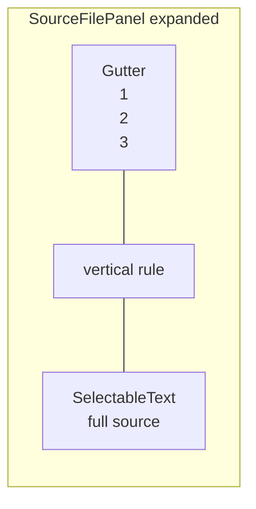

# Line numbers for expanded code

## Answer

Yes — this is possible without embedding [DartPad](https://dartpad.dev/). DartPad is a full online IDE; we only need its **gutter layout**: a fixed-width column of right-aligned line numbers beside monospace code.

You chose **line numbers only** (no syntax-highlighting package), which fits the project’s minimal-scope approach.

## Recommended layout



- **Gutter**: non-selectable `Text` widgets, right-aligned, muted color, slightly darker background (like DartPad’s left rail).
- **Code**: one `SelectableText` with `softWrap: false` so lines stay on one row and align vertically with the gutter when both use the same monospace `TextStyle` (`fontSize: 13`, shared `height`).
- **Selection**: copying selects code only — line numbers are not included (standard editor behavior).

## Implementation

### 1. New widget: `LineNumberedCodeView`

Add [`solid_principles/lib/presentation/widgets/line_numbered_code_view.dart`](solid_principles/lib/presentation/widgets/line_numbered_code_view.dart):

- Input: `String code`, `ColorScheme` (or `BuildContext`).
- Compute `lineCount` from `code.split('\n').length`.
- Compute gutter width from digit count (e.g. 2 chars for ≤99 lines, 3 for ≤999 — our files are small).
- Build:

```dart
SingleChildScrollView( // vertical
  child: SingleChildScrollView( // horizontal
    scrollDirection: Axis.horizontal,
    child: Row(
      crossAxisAlignment: CrossAxisAlignment.start,
      children: [
        Container(/* gutter bg + padding */,
          child: Column(
            crossAxisAlignment: CrossAxisAlignment.end,
            children: [ for (i) Text('$i', style: gutterStyle) ],
          ),
        ),
        VerticalDivider(width: 1, ...),
        SelectableText(code, style: codeStyle, softWrap: false),
      ],
    ),
  ),
)
```

- Gutter style: `colorScheme.onSurface.withValues(alpha: 0.5)`, `fontFamily: 'monospace'`, same `fontSize`/`height` as code.
- Gutter background: `colorScheme.surfaceContainerHigh` (slightly distinct from the existing code block background).

### 2. Wire into `SourceFilePanel`

Update [`solid_principles/lib/presentation/widgets/source_file_panel.dart`](solid_principles/lib/presentation/widgets/source_file_panel.dart):

- Replace the inner `SelectableText` block (lines 92–102) with `LineNumberedCodeView(code: snapshot.data!)`.
- Keep the outer `Container` decoration unchanged.

### 3. Verification

- `flutter analyze` and `flutter test` (no test changes required unless we add a small widget test for line count / gutter width logic).
- Manual: expand `reminder_validator.dart` on Chrome — confirm numbers align with lines, horizontal scroll works for long lines, and copied text excludes line numbers.

## Files changed

| File | Change |
|------|--------|
| **New** [`line_numbered_code_view.dart`](solid_principles/lib/presentation/widgets/line_numbered_code_view.dart) | Gutter + code layout |
| [`source_file_panel.dart`](solid_principles/lib/presentation/widgets/source_file_panel.dart) | Use new widget |

## Out of scope

- Syntax highlighting (`flutter_highlight`, etc.) — can be a follow-up if desired.
- Embedding or linking out to DartPad — not needed for inline reading.
