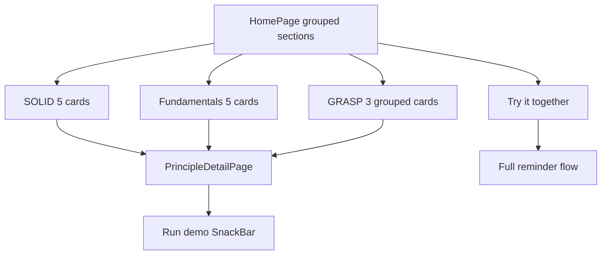

# Software Principles Sample App

## Goal

Add a **self-contained study app** under [`apps/solid_principles`](apps/solid_principles) for Flutter/Dart interview prep. One cohesive mini-domain (set a reminder → validate → save → notify) demonstrates **SOLID**, **GRASP**, and complementary principles (**KISS**, **DRY**, **YAGNI**, **SoC**, **CQS**). The app runs independently and is **excluded from Melos** so it stays local study material.

## Monorepo integration

- Scaffold with `flutter create apps/solid_principles --project-name solid_principles`.
- Add to [`melos.yaml`](melos.yaml) ignore list (alongside `apps/showcase`):

```yaml
ignore:
  - apps/showcase
  - apps/solid_principles
```

- **No dependency** on `core`, `models`, `ui_kit`, or `theme` — keeps examples easy to read in isolation.
- Minimal `pubspec.yaml`: `flutter` + `flutter_test` only; SDK aligned with main app (`>=3.10.8 <4.0.0`).
- Lightweight `analysis_options.yaml` using `flutter_lints` (no code generation, no injectable/build_runner).

## App UX (interview walkthrough)



- **Home screen**: three labeled sections + live demo card at top:
  1. **SOLID** — 5 cards (S, O, L, I, D)
  2. **Fundamentals** — KISS, DRY, YAGNI, SoC, CQS (one card each)
  3. **GRASP** — 3 grouped cards (see below), not 9 separate screens
- **Detail screen** (`PrincipleDetailPage`): plain-English explanation, “what to say in an interview” bullets, **Run demo** button, source file pointer.
- **Live demo screen**: enter reminder title → validate → save → pick email/push sender. Shows how principles compose in a real flow.

Keep styling minimal: default Material 3, no custom theme package.

## Folder layout

```
apps/solid_principles/
  lib/
    main.dart
    app.dart
    presentation/
      home_page.dart
      principle_detail_page.dart
      live_demo_page.dart
    domain/
      reminder.dart                 # immutable value type; owns isOverdue (GRASP: Information Expert)
    principles/
      solid/
        single_responsibility/      # S
        open_closed/                # O
        liskov_substitution/        # L
        interface_segregation/      # I
        dependency_inversion/       # D
      fundamentals/
        dry.dart                    # shared validation formatter
        kiss.dart                   # simple vs over-engineered path side-by-side
        yagni.dart                  # only what we need today (no SMS/recurrence yet)
        separation_of_concerns.dart # widget renders; controller/logic elsewhere
        command_query_separation.dart
      grasp/
        assignment_patterns.dart    # Information Expert, Creator, Controller
        coupling_cohesion.dart      # Low Coupling, High Cohesion
        change_patterns.dart        # Pure Fabrication, Protected Variations (+ cross-ref Polymorphism/Indirection to SOLID O/D)
    catalog/
      principle_info.dart           # id, section, title, summary, tips, demo callback, source paths
  test/
    principles_test.dart
```

## Principle coverage (same reminder domain throughout)

### SOLID (5 detail screens — unchanged core)

| Principle | File(s) | Interview talking point |
|-----------|---------|-------------------------|
| **S** | `reminder_validator`, `in_memory_reminder_store`, `reminder_controller` | One reason to change per class |
| **O** | `notification_sender` + `email_sender` / `push_sender` | Extend with `SmsSender` without editing `reminder_service` |
| **L** | `reliable_sender`, `flaky_sender` | Subtypes honor the contract callers expect |
| **I** | `reminder_reader` vs `reminder_writer` | Depend only on methods you use |
| **D** | `reminder_notifier` + constructor injection | High-level code depends on abstractions |

### Fundamentals (5 detail screens — newly first-class)

| Principle | Demo idea | Interview talking point |
|-----------|-----------|-------------------------|
| **DRY** | `ValidationMessages.formatEmptyTitle()` used by validator + UI error text | One source of truth; change wording in one place |
| **KISS** | Compare `SimpleReminderFormatter` (one method) vs commented “clever” alternative | Simplest code that works; avoid abstraction for its own sake |
| **YAGNI** | `ReminderService` supports title + due date only; comments show *not* building recurrence/SMS until required | Don’t build features ahead of need |
| **SoC** | `ReminderForm` widget only builds UI; `ReminderController` holds state/logic; store handles persistence | Each layer has one concern; mirrors Clean Architecture layers |
| **CQS** | `InMemoryReminderStore`: `save()` mutates, `findById()` reads — never `saveAndReturn()` | Commands change state; queries return data; don’t mix |

### GRASP (3 grouped detail screens — interview-friendly subset)

Full GRASP has 9 patterns; we cover all 9 in text but **group runnable demos** to stay simple:

| Group | Patterns included | Demo in reminder domain |
|-------|-------------------|-------------------------|
| **Who does the work?** | Information Expert, Creator, Controller | `Reminder.isOverdue()` (expert has the data); `ReminderFactory.create()` (creator); `ReminderController` handles the use-case flow (not the widget or entity) |
| **Healthy structure** | Low Coupling, High Cohesion | Controller depends on small interfaces (reader/writer/sender), not concrete store + 5 unrelated helpers; each class does one related job |
| **Managing change** | Pure Fabrication, Protected Variations, Polymorphism, Indirection | `InMemoryReminderStore` is a fabricated class (not a domain concept); `NotificationSender` interface shields callers from email vs push; cross-link to SOLID O/D rather than duplicate code |

**Note in UI**: Polymorphism and Indirection overlap with Open/Closed and Dependency Inversion — the GRASP screens explicitly say “same idea, different lens (assignment vs design quality).” Good interview answer material.

### Light cross-cutting mentions (no separate screens)

Kept as short bullets inside relevant detail pages or `Reminder` doc comment:

- **Tell, don’t ask** — `reminder.markSent()` instead of external field mutation
- **Composition over inheritance** — `MultiSender` composes senders
- **Immutability / `const`** — `Reminder` as value type
- **Manual DI** — mention production Multichoice uses `injectable` in [`packages/core`](packages/core)

## Comments style

- File-level doc comment (2–4 lines): what principle, why it matters
- Inline markers: `// SOLID-S:`, `// FUND-DRY:`, `// GRASP-Expert:`, `// CQS:` at key lines
- Each grouped GRASP file has a top comment listing all patterns in that group with one-line definitions

## Tests (interview bonus)

[`test/principles_test.dart`](apps/solid_principles/test/principles_test.dart) — focused, not exhaustive:

**SOLID (5)**
- Validator rejects empty title (S)
- New sender without changing service (O)
- Flaky sender substitutable (L)
- Summary service uses `ReminderReader` only (I)
- Notifier with fake dependencies (D)

**Fundamentals (3–4)**
- DRY formatter shared between validator and UI helper
- CQS: `save` does not return entity; `findById` does not mutate
- SoC: controller logic testable without `WidgetTester`

**GRASP (2)**
- `Reminder.isOverdue()` uses its own `dueAt` (Information Expert)
- `ReminderFactory` creates valid instances (Creator)

## How to run (top comment in `main.dart` only — no separate README)

```powershell
cd apps/solid_principles
flutter pub get
flutter run
flutter test
```

## Out of scope (kept simple on purpose)

- No BLoC, auto_route, freezed, or monorepo packages
- No Android/iOS flavor setup
- No CI workflow changes (ignored by Melos)
- No CHANGELOG update (study app, not shipped product)
- No 9 separate GRASP screens (grouped instead; all 9 named in copy)

## Validation after implementation

1. `flutter pub get` and `flutter analyze` inside `apps/solid_principles`
2. `flutter test` — all principle tests green
3. Manual smoke: launch app, browse all three Home sections, tap **Run demo** on each card, try live demo
