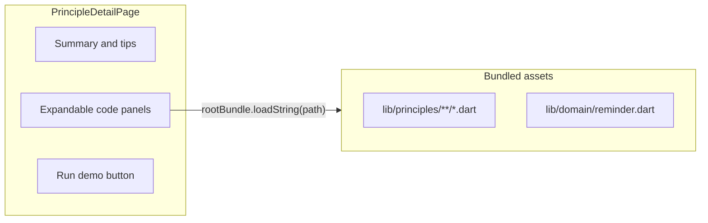

# UI polish and inline code examples

## Current state

- Theme is light-only in [`solid_principles/lib/main.dart`](solid_principles/lib/main.dart) (`ColorScheme.fromSeed` with default light brightness).
- [`solid_principles/lib/presentation/home_page.dart`](solid_principles/lib/presentation/home_page.dart) uses plain `Card` + `ListTile` with no section styling.
- [`solid_principles/lib/presentation/principle_detail_page.dart`](solid_principles/lib/presentation/principle_detail_page.dart) lists `sourcePaths` as monospace path strings only — no way to read the code.
- Principle source already lives under [`solid_principles/lib/principles/`](solid_principles/lib/principles/) and is referenced in [`solid_principles/lib/catalog/principle_info.dart`](solid_principles/lib/catalog/principle_info.dart).

## Approach



### 1. Dark theme by default

Update [`main.dart`](solid_principles/lib/main.dart):

- Add `darkTheme` with `ColorScheme.fromSeed(seedColor: Colors.indigo, brightness: Brightness.dark)`.
- Set `themeMode: ThemeMode.dark` so the app opens in dark mode on all platforms (including Chrome/web).
- Keep a light `theme` as fallback for users who switch system theme later (optional, minimal cost).

### 2. Home page color scheme

Update [`home_page.dart`](solid_principles/lib/presentation/home_page.dart) with lightweight styling (no new packages):

- **Hero card** (“Try it together”): tinted surface using `colorScheme.primaryContainer` + primary icon; subtle rounded border.
- **Section headers** (SOLID / Fundamentals / GRASP): small colored accent chip or left-border strip per section:
  - SOLID → indigo
  - Fundamentals → teal
  - GRASP → amber
- **Principle cards**: optional thin leading accent color matching their section; keep existing navigation behavior.

All colors will use `ColorScheme` / `withValues(alpha: …)` so they look correct in dark mode.

### 3. Selectable text

Wrap readable content in `SelectionArea` so users can copy interview tips, summaries, demo output, and code:

| Page | Change |
|------|--------|
| [`principle_detail_page.dart`](solid_principles/lib/presentation/principle_detail_page.dart) | Wrap `ListView` body in `SelectionArea`; use `SelectableText` for demo result and code blocks |
| [`home_page.dart`](solid_principles/lib/presentation/home_page.dart) | Wrap `ListView` in `SelectionArea` (ListTile taps still work) |
| [`live_demo_page.dart`](solid_principles/lib/presentation/live_demo_page.dart) | Wrap status output in `SelectionArea` / `SelectableText` |

### 4. Expandable source code panels (actual file contents)

**Why assets:** Flutter web cannot read arbitrary files from `lib/` at runtime. Bundling the same paths as assets lets us show the real source without maintaining duplicate snippet strings.

**Register assets** in [`pubspec.yaml`](solid_principles/pubspec.yaml):

```yaml
flutter:
  assets:
    - lib/principles/
    - lib/domain/reminder.dart
```

This covers every path already listed in `sourcePaths` across all 13 principles.

**New widget** — e.g. [`solid_principles/lib/presentation/widgets/source_file_panel.dart`](solid_principles/lib/presentation/widgets/source_file_panel.dart):

- `ExpansionTile` titled with the file name (e.g. `reminder_validator.dart`) and subtitle with the full path.
- On expand: `FutureBuilder` loads content via `rootBundle.loadString(assetPath)` where `assetPath` matches the existing `sourcePaths` entry exactly.
- Display inside a scrollable container (horizontal + vertical) with monospace `SelectableText`, dark-friendly background (`surfaceContainerHighest`), and rounded border.
- Loading / error states: small spinner or “Could not load file” message.

**Update detail page** — replace the plain path list under “Source files” with:

- Rename section to **“Code examples”** (clearer intent).
- One `SourceFilePanel` per entry in `principle.sourcePaths`.
- Demo result block also uses `SelectableText`.

Example UX for Single Responsibility:

```
Code examples
  ▶ reminder_validator.dart
  ▶ reminder_controller.dart   ← tap to expand and read full source
```

### 5. Web support

No platform-specific branching needed:

- Asset bundling works identically on web, mobile, and desktop.
- Live demo and “Run demo” already run on web.
- Optionally add a Chrome launch config to [`.vscode/launch.json`](.vscode/launch.json) with `"deviceId": "chrome"` for one-click web debugging (small convenience, not required for code viewing).

### 6. Verification

- Run `flutter test` in `solid_principles/` (existing tests should pass unchanged).
- Manual check: `flutter run -d chrome`, open **S — Single Responsibility**, expand both code panels, confirm full Dart source loads and text is selectable.
- Confirm home page renders in dark mode with section accents.

## Files to change

| File | Purpose |
|------|---------|
| [`main.dart`](solid_principles/lib/main.dart) | Dark theme default |
| [`home_page.dart`](solid_principles/lib/presentation/home_page.dart) | Section colors + `SelectionArea` |
| [`principle_detail_page.dart`](solid_principles/lib/presentation/principle_detail_page.dart) | Code panels + selectable content |
| [`live_demo_page.dart`](solid_principles/lib/presentation/live_demo_page.dart) | Selectable demo output |
| [`pubspec.yaml`](solid_principles/pubspec.yaml) | Asset paths for source files |
| **New** `presentation/widgets/source_file_panel.dart` | Expandable code loader widget |
| [`.vscode/launch.json`](.vscode/launch.json) | Optional Chrome config |

## Out of scope (kept simple)

- Syntax highlighting package (e.g. `flutter_highlight`) — plain monospace is sufficient for v1; can add later if desired.
- Curated “highlight only these lines” excerpts — full file content matches the user’s ask to see the actual file.
- README updates — not requested.
